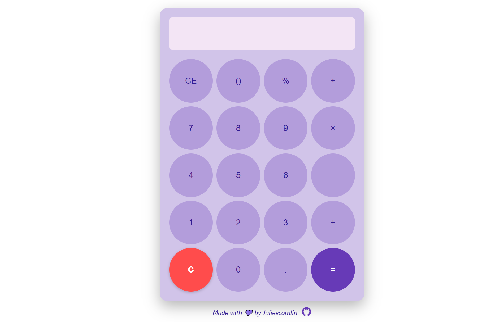

# Cute Calculator
An aesthetic, responsive calculator built with HTML, CSS, and JavaScript. Styled with a soft lavender palette. Includes basic arithmetic functionality and a polished, user-friendly interface.

## Features
- Responsive design
- Circular buttons with soft hover effects
- Light lavender theme with calm tones
- Functionality: +, −, ×, ÷, (), %, clear, equals
- Backspace support
- Intelligent parentheses 
- Footer with GitHub link

## Preview


## Live Demo
You can view it live [here](https://Julieecomlin.github.io/Cute-Calculator/)  

## How to Use
1. Clone the repo:
   ```bash
   git clone https://github.com/Julieecomlin/Cute-Calculator.git
2. Open index.html in your browser to use the calculator.

## Tech Stack
- HTML5
- CSS3
- JavaScript (Vanilla)

## Author
Made with 💜 by [Julieecomlin](https://github.com/Julieecomlin)
